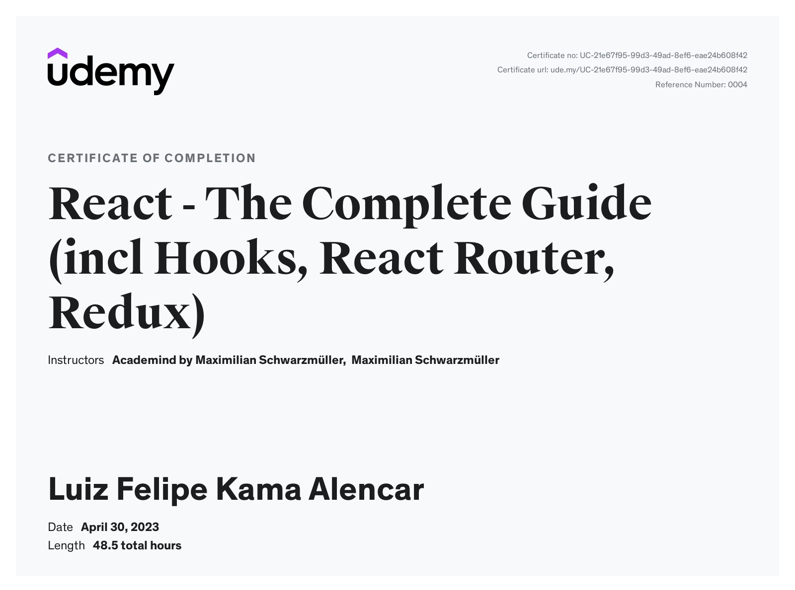

# ReactJS Studies Repository

Welcome to my ReactJS studies repository! This repository contains the projects and exercises I developed while taking the Udemy course [React - The Complete Guide (incl Hooks, React Router, Redux)](https://www.udemy.com/course/react-the-complete-guide-incl-redux/).

## Course Certificate

<a href="https://www.udemy.com/certificate/UC-21e67f95-99d3-49ad-8ef6-eae24b608f42/">

</a>

I completed the course and received a certificate which can be viewed [here](https://www.udemy.com/certificate/UC-21e67f95-99d3-49ad-8ef6-eae24b608f42/).

## Repository Contents

This repository includes various projects and exercises covering a wide range of topics in React, such as:

- Basic React concepts
- State management with React Hooks
- Routing with React Router
- State management with Redux
- Advanced React patterns and optimization techniques

## Project Structure

Each folder within this repository corresponds to a different project or exercise. The structure is as follows:

- **project1/**: Description of the first project.
- **project2/**: Description of the second project.
- **project3/**: Description of the third project.
- **...**

## How to Use

To explore the projects, you can clone this repository and run the projects locally:

```bash
git clone https://github.com/luiz-k-alencar/ReactJS.git
cd ReactJS/project1
npm install
npm start
```

Repeat the steps for other projects by navigating to the respective directories.

## Conclusion

This repository is a testament to my learning journey in ReactJS. Feel free to explore the projects and use them as references for your own learning.

If you have any questions or feedback, feel free to open an issue or contact me.

Happy coding!
